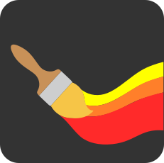

# PhotoRust




A from-scratch clone of Adobe Photoshop CS6 (the 2012–2013 "Kona" dark UI).

A **C++/Qt QWidgets shell** over a **Rust image engine**, joined by
[CXX-Qt](https://github.com/KDAB/cxx-qt).

- [docs/REFERENCE.md](docs/REFERENCE.md) — the interface in full: window layout,
  every tool and flyout, the panels, and the complete keymap for Linux and macOS.
- [CLAUDE.md](CLAUDE.md) — architecture, and the rules that keep the two halves
  separate.

Targets **Linux and macOS**. Windows is out of scope, and the top-level
`CMakeLists.txt` fails the configure step there rather than half-working.

---

## Status

This is an early but working milestone: the app builds, runs, and you can
paint, manage layers, select, filter and undo.

**Working**

- CS6-style dark UI: menu bar with "photorust" branding, options bar, left tool
  strip, dockable panels (Color/Swatches/Info tabbed, History,
  Layers/Channels/Paths tabbed), status bar.
- **Several documents open at once**, one tab each above the canvas. Each keeps
  its own layers, selection, history and zoom; File ▸ New and File ▸ Open add a
  tab rather than replacing what you had.
- Tool strip with SVG line-art icons, the corner triangle marking tools that
  have hidden tools, press-and-hold (or right-click) flyout menus listing each
  CS6 tool group, and the footer swatch / Quick Mask / screen-mode controls.
- Canvas viewport with zoom (CS6's zoom stops), an editable zoom field in the
  status bar, cursor-anchored wheel zoom,
  pan (space-drag or middle-drag), and a transparency checkerboard.
- Layers: add, delete (multi-select with Shift/Ctrl click), duplicate, reorder,
  merge down, flatten, rename, show/hide, opacity, fill opacity, clipping masks,
  layer masks, thumbnails.
- **Layer locks**, enforced in the engine rather than by greying out buttons:
  lock transparent pixels, lock image pixels, lock position, and lock all. A
  pixel-locked layer refuses every tool — brushes, healing, filters, fills — and
  a fully locked one cannot be deleted or merged either. Locked rows carry a
  padlock badge, solid for Lock All and outlined for a partial lock.
- A **CS6-shaped Layers panel**: the filter row, blend mode and Opacity, the Lock
  row and Fill, delegate-painted rows (eye column, bordered thumbnail, italic
  Background, padlock badge) and CS6's seven footer glyphs — all drawn as line
  art on the same 20×20 grid as the tool icons. Multi-layer selection
  (Shift+click for range, Ctrl+click for toggle) and bulk delete.
- A **Channels panel** tabbed alongside Layers and Paths, showing the composite
  channel and individual colour channels for the current mode (RGB shows
  Red/Green/Blue, CMYK shows Cyan/Magenta/Yellow/Black, Grayscale shows Gray,
  Lab shows Lightness/a/b). Each row has a visibility eye, a grayscale
  thumbnail extracted from the composite, and the CS6 shortcut label. Toggling
  a channel's eye hides that channel on the canvas in real time (hiding Red
  shows cyan, hiding Blue shows yellow, etc.). The composite eye toggles all
  channels at once. New Channel and Delete Channel buttons for user alpha
  channels.
- All **27 Photoshop blend modes**, including the non-separable ones (Hue,
  Saturation, Color, Luminosity, Darker/Lighter Color).
- Brush engine: dab-based strokes with spacing, hardness falloff, flow and
  opacity; a whole stroke is one undo step. Dab edges are **area-sampled**, so a
  hard brush has a genuinely antialiased edge rather than a staircase. **Tip shape** (roundness and angle),
  **scattering** (spread and dab count) and **shape dynamics** (size, angle and
  roundness jitter), all reproducible from a fixed per-stroke seed so the live
  preview matches the commit.
- **Pencil** tool: the same engine with antialiasing off, so it lays whole
  pixels only, plus CS6's Auto Erase.
- **Color Replacement Brush**: recolours pixels matching a sampled colour,
  blending in Hue, Saturation, Color or Luminosity, with CS6's Sampling
  (Continuous, Once, Background Swatch), Limits (Discontiguous, Contiguous,
  Find Edges), Tolerance and Anti-alias. Color mode keeps each pixel's
  brightness, so shading survives being recoloured.
- **Dodge**, **Burn** and **Sponge**: the darkroom toning tools, with CS6's Range
  (shadows / midtones / highlights), Exposure, Protect Tones, and the Sponge's
  Desaturate / Saturate and Vibrance. Protect Tones works on luminance and keeps
  the pixel's own colour, so a dodge cannot bleach a hue or clip to white.
- **Blur**, **Sharpen** and **Smudge**: all three work dab by dab on what they
  pass over, so dwelling goes on deepening the effect. Blur and Sharpen are one
  tool with its sign flipped — toward or away from the local average — with CS6's
  Strength, cut-down Mode list, Sample All Layers and Sharpen's Protect Detail.
  Smudge carries a *patch* of pixels along the stroke, so structure streaks in the
  direction of travel, and Finger Painting drags in the foreground colour. Distinct
  from the Blur and Sharpen *filters*, which are one pass over a whole layer.
- **Paint Bucket**: the Magic Wand's flood, filled instead of selected — so
  Tolerance, Contiguous and Anti-alias behave identically to the wand's — plus
  Mode, Opacity and All Layers.
- **Pen tool**: full vector paths — corner and smooth anchors, direction
  handles that stay collinear through a smooth point, Auto Add/Delete, Rubber
  Band preview, closing a subpath, and Add/Delete Anchor Point and Convert
  Point as their own tools. Path Selection and Direct Selection edit whole
  subpaths or individual anchors/handles. A **Paths panel** holds named paths
  and a Photoshop-style Work Path, with Fill Path, Stroke Path and Load Path
  as a Selection (nonzero winding, so an oppositely-wound subpath cuts a hole).
  Freeform Pen fits a drag to corner anchors by simplification rather than
  true curve-fitting — a deliberate simplification, noted in the reference.
  Path geometry is not itself undoable, the same choice already made for
  slices and annotations; what a finished path paints or selects is.
- **Gradient tool**: all five CS6 shapes (linear, radial, angle, reflected,
  diamond) over CS6's 15 default presets, with Mode, Opacity, Reverse, Dither and
  Transparency. Ramps interpolate in straight alpha so a fade to transparent
  keeps its colour, and dither works on the colour quantisation so hard-edged
  presets stay hard. Preset swatches are rendered by the engine, so they cannot
  drift from what the tool paints.
- **Clone Stamp**: `Alt`+click sets the source, and the stroke copies those
  pixels verbatim — CS6's **Aligned** and **Sample** (current layer, current and
  below, all layers) included. Each stroke samples a snapshot taken when it
  began, so cloning with a short offset repeats the source once instead of
  smearing it down the stroke.
- **Mixer Brush**: paint that mixes. CS6's Wet, Load, Mix and Flow, its preset
  menu, the load swatch with Load and Clean Brush, the two after-each-stroke
  toggles, `Alt`+click to load paint off the canvas, and Sample All Layers. A wet brush picks colour up as it travels and
  carries it along, so a stroke across a boundary smears; a dry one paints its
  own paint like an ordinary brush and stops when the load runs out.
- A CS6-style **brush preset picker** behind the options bar's tip button:
  preview, Size and Hardness sliders, and a grid covering CS6's families — soft
  and hard round, flat and chisel, charcoal and chalk, spatter, star, grass.
  Thumbnails are rendered by the brush engine itself, so they cannot drift from
  what the brush paints.
- The whole healing family. **Spot Healing Brush** with CS6's three types:
  Proximity Match (a Laplace solve that continues the surrounding shading),
  Create Texture (the same, plus grain matched to the neighbourhood) and
  Content-Aware (patch synthesis inward from the boundary, so edges carry
  across). **Healing Brush**, which transplants an `Alt`-clicked source's
  texture by Poisson solve, so it takes the destination's lighting rather than
  the source's. **Patch** and **Content-Aware Move** (with Extend), both working
  on a dragged region. **Red Eye**, which neutralises only where red genuinely
  dominates, so it can be dragged loosely over an eye. Each is one undo step.
- Selections: all four marquee variants (rectangular, elliptical, single row,
  single column), all three lassos (freehand, polygonal, and magnetic with
  live-wire edge snapping), and both colour tools (Quick Selection's
  edge-stopping region growing, and the Magic Wand) — all with antialiased
  edges, add/subtract/intersect, invert and feather. `Shift+M`, `Shift+L` and
  `Shift+W` cycle within each group, as CS6 does. Marching ants trace the
  mask's real 50% contour, so an ellipse reads as an ellipse and a subtracted
  region shows its hole.
- Crop: a CS6-style box with eight handles, a dimmed shield outside it and a
  rule-of-thirds overlay, aspect-ratio presets, and CS6's Delete Cropped Pixels
  option — clear it and the pixels outside are kept, hanging off the canvas
  edge, ready to come back.
- Perspective Crop: mark the four corners of something that should be
  rectangular and it is straightened onto a rectangle through a homography,
  with bilinear resampling. Every layer and mask goes through the same
  transform, so the stack stays in register.
- Annotation tools: colour samplers (ten, as in CS6), a ruler reporting
  X/Y/W/H/angle/distance, pinned text notes, and numbered count markers. None
  of them touch pixels — they are document data alongside slices.
- An **Info panel** (`F8`) in CS6's layout: live RGB and CMYK under the cursor,
  cursor position, selection size, a numbered grid of sampler values, and the
  document's memory footprint. With the Ruler active it switches to CS6's
  ruler layout — angle and length in place of CMYK, and the ruler's deltas in
  place of the selection size.
- Slices: cut the canvas with the Slice tool and the rest is auto-sliced around
  it, numbered in reading order with CS6's blue and grey badges. Slice Select
  moves, resizes and deletes them, and File ▸ Save Slices writes each one out
  as its own PNG.
- Adjustments (destructive and as non-destructive adjustment layers) and
  filters (Gaussian blur, sharpen, unsharp mask, noise).
- A Photoshop-style **Color Picker**: square field + vertical ramp driven by
  the H/S/B/R/G/B radio buttons (each re-maps both axes as CS6 does),
  new/current comparison, HSB/RGB/Lab/CMYK readouts, hex entry, and web-safe
  snapping.
- Undo/redo with a linear History panel, bounded by state count and memory.
  A snapshot carries the canvas size as well as the layer stack, so Crop and
  Canvas Size step back correctly.
- Photoshop CS6 default keymap, loaded from data and user-remappable.
- **Edit ▸ Keyboard Shortcuts** dialog: tree of all commands grouped by menu,
  inline key-capture editing, conflict detection, Undo/Use Default per binding,
  saved to user keymap on OK.
- **Edit ▸ Color Settings** dialog: CS6 layout with Working Spaces, Color
  Management Policies, Conversion Options and Advanced Controls. Settings
  persist to `~/.config/PhotoRust/color_settings.json`.
- **Image ▸ Mode** submenu with Bitmap, Grayscale, Duotone, Indexed Color, RGB
  Color, CMYK Color, Lab Color, Multichannel and bit-depth toggles. Grayscale
  prompts "Discard color information?" and converts pixels via Rec. 601
  luminance. **CMYK Color** converts through the CMYK colour space (RGB→CMYK→RGB
  round-trip clips out-of-gamut colours). **Indexed Color** opens a CS6-style
  dialog with Palette, Colors, Forced, Dither and a live Preview checkbox;
  quantisation uses median-cut with Floyd-Steinberg dithering. Bitmap and
  Duotone are greyed out unless the image is already Grayscale, matching CS6.

**Not yet implemented**

- **PSD layer pixel data.** The parser reads the header, layer records and the
  flattened composite, so opening a `.psd` gives you a single Background layer.
  Per-layer channel data, ZIP compression, 16/32-bit and CMYK/Lab return an
  explicit `Unsupported` error rather than wrong pixels. Writing emits a valid
  single-layer file. This is the largest remaining piece — see CLAUDE.md §8.
- GPU canvas rendering. Painting is `QPainter` today; the backend-agnostic
  renderer described in CLAUDE.md §7 has not been built.
- Text, shapes, transforms, layer effects, adjustment-layer parameter dialogs,
  Navigator panel.
- Channel visibility is view-only — selecting an individual channel does not
  yet isolate it for editing. Alpha channels created via the Channels panel's
  New Channel button are display-only placeholders (not wired to the engine).
- Marquee, Lasso and Quick Selection are the fully implemented strip groups.
  For every other tool the flyout lists the full CS6 group, but only the first
  entry works; the rest are shown disabled rather than silently falling back to
  the parent tool. Quick Mask toggles its button but does not yet change editing
  behaviour, and screen modes are not implemented.
- Tool icons are line-art reconstructions in CS6's visual language, not
  Adobe's artwork.
- In the Color Picker: Lab values are editable but have no radio buttons, so
  L/a/b cannot drive the field and ramp. CMYK is a direct conversion with no
  press profile, so it will not match a colour-managed Photoshop (which uses
  an ICC profile such as US Web Coated). "Add to Swatches" and "Color
  Libraries" are present for layout but disabled.

---

## Prerequisites

- **Qt 6** (6.4+) with QWidgets development headers
- A **stable Rust** toolchain (1.75+)
- **CMake** 3.24+
- A C++17 compiler

Corrosion and the CXX-Qt CMake module are fetched automatically at configure
time, so the first configure needs network access.

```bash
# Fedora
sudo dnf install qt6-qtbase-devel qt6-qtsvg-devel cmake gcc-c++ mold

# Debian / Ubuntu
sudo apt install qt6-base-dev libqt6svg6-dev cmake g++ mold

# macOS
brew install qt cmake rust
```

`mold` (or `lld`) is not strictly required, but the Rust build warns without
one and linking is much slower with GNU `ld.bfd`.

## Build and run

```bash
cmake -S . -B build -DCMAKE_BUILD_TYPE=Debug
cmake --build build -j$(nproc)

./build/photorust
```

CMake drives both halves: Corrosion invokes Cargo for `core/`, and the
resulting static library is linked into the shell. The theme, keymap and icon
are staged next to the executable, so a fresh build runs without installing.

To get a launcher entry and a desktop icon, install it:

```bash
cmake --install build --prefix ~/.local
```

That puts the binary in `~/.local/bin`, the icon into the hicolor theme and
`org.photorust.PhotoRust.desktop` into `~/.local/share/applications`. The
running window already shows the icon without installing; the desktop entry is
what gives it a launcher, a name and a file association for `.psd`.

### Tests

The engine's tests live beside the code they cover:

```bash
cd core && cargo test        # 605 tests
```

or through CTest, which runs them as part of the project:

```bash
ctest --test-dir build --output-on-failure
```

---

## Layout

```
core/                 Rust image engine
  src/buffer.rs         RGBA8 pixel buffers, rectangles
  src/blend.rs          the 27 blend modes
  src/layer.rs          layer model and stack
  src/compositor.rs     stack → final image (parallel, rayon)
  src/brush.rs          dab-based stroke rendering
  src/healing.rs        inpainting, Poisson cloning and red-eye removal
  src/replace.rs        colour replacement for the Color Replacement Brush
  src/mixer.rs          wet-paint mixing for the Mixer Brush
  src/stamp.rs          source sampling for the Clone Stamp
  src/gradient.rs       colour ramps and the five gradient shapes
  src/bucket.rs         flood filling for the Paint Bucket
  src/focus.rs          the Blur and Sharpen tools
  src/smudge.rs         the Smudge tool's carried patch
  src/tone.rs           the Dodge, Burn and Sponge tools
  src/path.rs           vector paths for the Pen tool and Paths panel
  src/selection.rs      coverage-mask selections
  src/magnetic.rs       edge snapping for the Magnetic Lasso
  src/wand.rs           Magic Wand flood and Quick Selection region growing
  src/perspective.rs    homography warp for the Perspective Crop tool
  src/slice.rs          web-export slices and auto-slice generation
  src/annotation.rs     colour samplers, notes, count markers, ruler
  src/filters/          adjustments and convolutions
  src/history.rs        bounded linear undo
  src/document.rs       one open image; ties the above together
  src/psd/              .psd parsing and writing
  src/bridge.rs         the CXX-Qt QObject exposed to C++

shell/                C++ / Qt QWidgets application
  src/MainWindow.*      menus, docks, options bar
  src/dialogs/          Keyboard Shortcuts, Color Settings, Indexed Color, etc.
  src/canvas/           viewport, zoom/pan, channel masking, input → document coordinates
  src/panels/           Layers, Channels, Paths, Color, History (LayerIcons/PathIcons hold the artwork)
  src/tools/            tool strip and tool metadata
  src/shortcuts/        command registry and keymap loading
  resources/theme.qss       CS6 dark theme
  resources/shortcuts.json  CS6 default keymap
```

## Conventions worth knowing before editing

These are the ones that cause real bugs if missed:

- **Colour is straight (non-premultiplied) alpha** everywhere in the engine.
  Premultiplication happens once, when a buffer is handed to Qt.
- **Layer stacks are stored bottom-first** (index 0 is the Background). The
  Layers panel shows them top-first. That flip happens *only* in `bridge.rs`;
  everything downstream of it speaks panel indices, everything upstream speaks
  stack indices.
- **Shortcuts are data.** Never hard-code a key combo in a widget — register a
  command and bind it in `shortcuts.json` (CLAUDE.md §9).
- **Blur and convolution run on premultiplied colour.** Filtering straight
  alpha lets the colour of fully transparent pixels bleed into visible ones,
  which shows up as dark halos on soft edges.
- **Selection queries walk the whole mask.** `is_empty`, `bounds` and `outline`
  are all O(canvas). They memoise, but the answers still have to be hoisted out
  of per-pixel loops and off the per-dab repaint path. `canvasChanged` fires on
  every brush dab; only `selectionChanged` should trigger a re-trace.
- **`QImage`s crossing the bridge must own their pixels.** Wrapping a Rust
  allocation with `QImage::from_raw_bytes` and returning it does not work: the
  wrapper is a temporary whose destructor frees the Rust buffer, leaving the
  C++ side pointing at freed memory. `bridge.rs::pixmap_to_qimage` deep-copies
  for this reason, and the comment there explains what a zero-copy version
  would need.

User keymap overrides are written to
`~/.config/PhotoRust/shortcuts.json` (Linux) or the equivalent
`AppConfigLocation` on macOS; only bindings that differ from the defaults are
stored, so future default changes still reach the user.


## Development progress

```

## ToolTip floating bar

- move tool - done
- marquee tools - done
- lasso tools - done
- quick selection tools - done
- crop tools - done
- eye dropper tools - done
- healing tools - done
- brush tools - done
- stamp and clone tools - done
- history brush tool - not started
- eraser tools - done
- gradient tools - done
- blur tools - done
- dodge tools - done
- pen tools - done
- type tools - done
- selection tools -  done
- shape tools - done
- hand tools - done
- zoom tools - done
- Color picker tool - done
- Mask modes - quick mask and standard modes - done

## Side bar (Layers, Channels, Paths, History, Color, Swatches, Text etc)

- Layers 
  - add ability to lock layer from modification - done
- Channels - in progress

## Top Menu bar - about 10% done, missing many features like Adjustments, Filters, etc

- File dropdown

    - add Open Recent - done
    - add Close All - done
    - add File Info tool - done
    - File Open > open multiple files by holding Shift + Clicking - done
    - open Photoshop PSD file with layers and full PSD info - done
    - add Print dialogue and Print options - done
    - Export As - done

- Edit dropdown - in progress
    ---  DONE
      - Cut
      - Copy
      - Copy Merged
      - Paste
      - Paste special
      - Clear

    --- DONE
    - check spelling - skip for now
    - find and replace text - done
    
    --- - in progress
    - Fill 
    - Stroke

    --- - in progress
    - Content Aware Scale
    - Puppet Warp
    - Perspective Warp
    - Free Transform - done
    - Transform - Scale, Rotate, Skew, Distort, Perspective, Warp -  done
    - Auto Align Layers - in progress
    - Auto Blend layers

    ---
    - Define Bursh Preset
    - Define Pattern
    - Define Custom Shape
    ---
    - Purge > Undo, Clipboard, Histories, All
    ---
    - Color Settings - UI done, need engine work
    - Assign Profile
    ---
    - Keyboard Shortcuts - done
    - Menus
    - Preferences
    
- Image dropdown
    ---
    Mode >  - in progress
      - Bitmap
      - Grayscale - done 
      - Duotone
      - Indexed Color - in progress
      - RGB Color
      - CMYK Color
      - Lab Color
      - Multichannel
      ---
      - 8 bits/channel
      - 16 bits/channel
      - 32 bits/channel
    Adjustments > 
      --- 
      - Brightness/Contrast - not started
      - Levels - not started
      - Curves - not started
      - Exposure - not started
      ---
      - Vibrance - not started
      - Hue/Saturation - not started
      - Color Balance - not started
      - Black & White - not started
      - Photo Filter - not started
      - Channel Mixer - not started
      - Color Lookup - not started
      ---
      - Invert - not started
      - Posterize - not started
      - Threshold - not started
      - Gradient Map - not started
      - Selective Color - not started
      ---
      - Shadows/Highlights
      - HDR Toning
      ---
      - Desaturate - not started
      - match color - not started
      - Replace color - not started
      - Equalize
      ---
    Image Size
    Canvas Size
    Image Rotation > 180, 90 clockwise, 90 counter clock, arbitrary, flip canvas H, flip canvas V
      
- Layer dropdown
- Type dropdown
- Select dropdown
- Filter dropdown
- View dropdown
- Window dropdown
- Help dropdown
Auto recovery - save working project to temp file for auto recover - not started


File format support:

- GIF - in progress 
- JPG
- BMP
- PSD - not started
- RAW
- PNG
- TIFF

```
