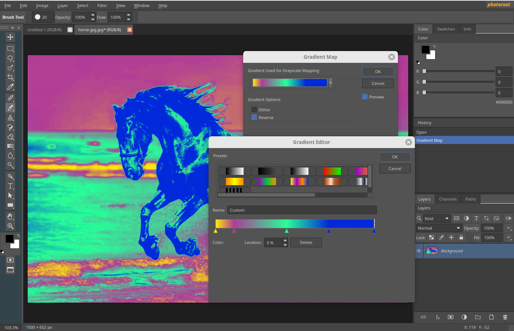

# PhotoRust


A from-scratch clone of Adobe Photoshop CS6 — the 2012–2013 "Kona" dark UI —
for **Linux and macOS**.



---

## What it is

An image editor that aims to look and behave like Photoshop CS6: the same dark
interface, the same dockable panels, the same tools in the same places, and the
same keyboard shortcuts.

It is an early but working milestone. You can open and create images, paint,
manage layers, make selections, run filters and adjustments, and undo. It is
not finished, and it is not a drop-in replacement for Photoshop — the section
below is honest about where the gaps are.

Uses your **graphics card when you have one**, and works normally when you do
not; a missing GPU costs speed, never features.

---

## Trying it

There are no prebuilt downloads yet, so you build it from source:

```bash
cmake -S . -B build -DCMAKE_BUILD_TYPE=Debug
cmake --build build -j$(nproc)

./build/photorust
```

You will need Qt 6, a Rust toolchain and CMake first —
[docs/BUILDING.md](docs/BUILDING.md) has the package names for Fedora, Debian
and macOS, plus how to install a launcher entry.

---

## Where it stands

**You can already:**

- Work on several images at once, each with its own layers, selection, history
  and zoom.
- Paint with a real brush engine — spacing, hardness, flow, opacity, pressure —
  plus Pencil, Eraser, Clone Stamp, Mixer Brush and the healing family.
- Use layers properly: masks, clipping, locks, opacity, and all **27 Photoshop
  blend modes**.
- Select with marquees, lassos, Magic Wand and Quick Selection, then feather,
  grow, refine and invert.
- Apply adjustments (Levels, Curves, Hue/Saturation, Selective Color,
  Shadows/Highlights and more) and filters, with live previews.
- Draw vector paths with the Pen tool, use gradients, crop, and undo through a
  History panel.
- Open and save PNG, JPEG, TIFF, GIF, BMP and RAW.

**Not yet:**

- **`.psd` support is partial.** Reading falls back to the flattened composite,
  so a Photoshop file opens as a single Background layer. Per-layer data, ZIP
  compression, 16/32-bit and CMYK/Lab are refused with a clear error rather
  than producing wrong pixels.
- Text, shapes, transforms and layer effects.
- Many tools show their full CS6 flyout, but only the first entry works; the
  rest are visibly disabled rather than silently doing something else.
- Tool icons are line-art reconstructions in CS6's visual language, not Adobe's
  artwork.

[docs/ROADMAP.md](docs/ROADMAP.md) has the detailed, feature-by-feature state.

---

## Documentation

- [docs/REFERENCE.md](docs/REFERENCE.md) — the interface in full: window
  layout, every tool and flyout, the panels, and the complete keymap for Linux
  and macOS.
- [docs/BUILDING.md](docs/BUILDING.md) — prerequisites, building, installing,
  running the tests.
- [docs/ARCHITECTURE.md](docs/ARCHITECTURE.md) — how it is put together, the
  tech stack, and the conventions to know before editing.
- [docs/ROADMAP.md](docs/ROADMAP.md) — what is done and what is not.
- [docs/gpu-migration.md](docs/gpu-migration.md) — GPU acceleration: plan,
  measurements, findings.
- [CLAUDE.md](CLAUDE.md) — the rules that keep the two halves separate.
